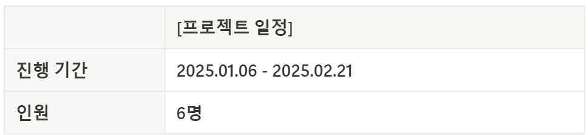
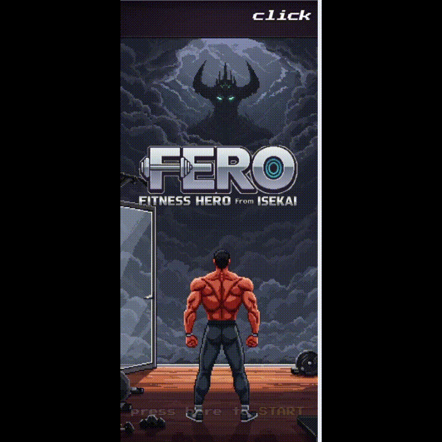
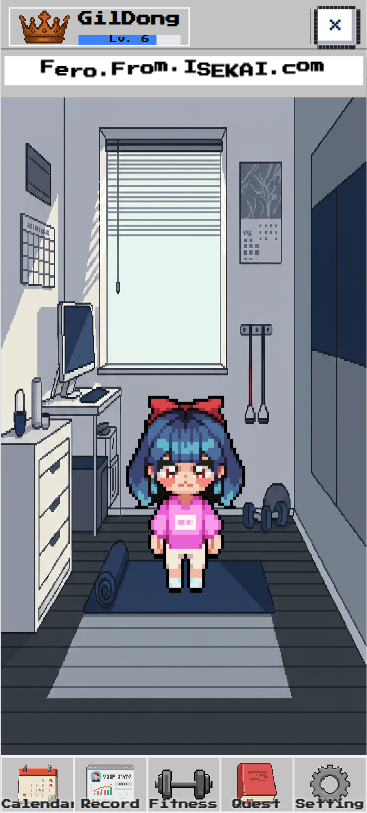
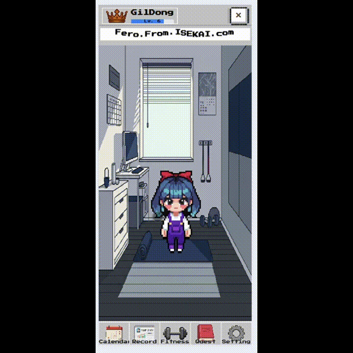
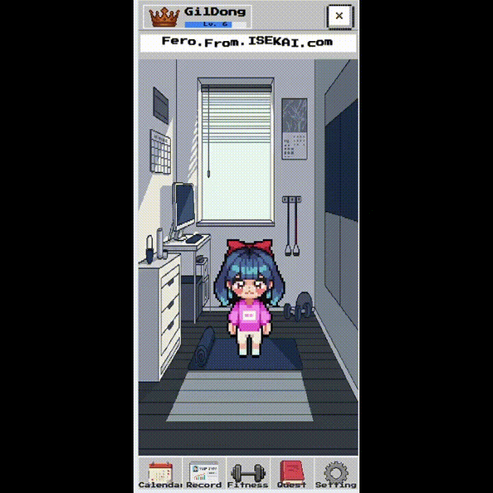
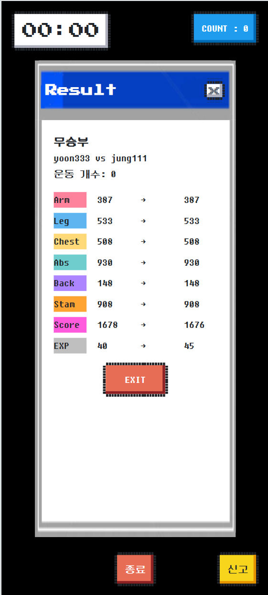

# README

# 목차

---

1. [소개영상(UCC)]
2. [프로젝트 일정]
3. [기획 배경]
4. [타겟층 및 목표]
5. [서비스 개요]
6. [서비스 화면 및 기능 소개]
8. [기술스택]
9. [프로젝트 구조]
10. [팀원 역할 및 분배]

---

# **🎞️**소개영상(UCC)

---

# **🗓️**프로젝트 일정

---

# **🗺️**기획 배경

---

### **홈 트레이닝의 문제점과 해결방안**

💡 코로나 이후 홈 트레이닝(홈트)의 수요는 급증했지만, **지속적인 동기부여 부족, 운동 자세 교정의 어려움, 혼자 하는 운동의 단조로움** 등의 문제로 인해 꾸준히 운동을 지속하는 사용자는 많지 않음.

💡 기존 피트니스 서비스는 운동 루틴 제공에 집중되어 있어 **게임 요소가 부족하고, 운동을 함께할 수 있는 소셜 기능이 미흡함**.

🔍 **FERO는 운동을 재미있게 지속할 수 있도록 '게임화(Gamification)'된 피트니스 환경을 제공하는 웹 앱!**

- **운동을 게임**처럼 즐길 수 있도록 **스토리, 레벨업, 랭크 시스템을 도입**
- **실시간**으로 친구와 운동하며 **경쟁**하고 **소통**할 수 있는 기능 제공
- **자세 인식**을 통해 운동 수행을 정량적으로 **측정**, **피드백** 제공

# **🎯**타겟층 및 목표

---

### 타겟층

- 🏋️‍♂️ **홈트족**: 혼자 운동할 때 동기부여가 부족한 사람
- 🎮 **게임을 좋아하는 운동 초보자**: 재미 요소가 가미된 운동을 원하는 사람
- 💪 **피트니스 매니아**: 자신의 운동 데이터를 기록하고 경쟁을 즐기는 사람
- 🏠 **공간 제약 없이 운동하고 싶은 사람**: 헬스장 없이도 운동을 꾸준히 하고 싶은 사람

### 목표

1. **즉각적인 보상**을 통한 **지속적인 동기부여** 제공
2. 운동 커뮤니티 형성
3. 공간의 제약 없이 **함께 운동할 수 있는 환경** 제공
4. **운동 데이터 기록** 가능
5. 개인화된 매칭 서비스 제공

# **📰**서비스 개요

---

### **FERO**는 **운동과 게임을 결합한 웹 기반 피트니스 플랫폼**입니다.

- **실시간 운동 대결**, **운동 자세 분석**, **캐릭터 육성**, **커뮤니티 기능**을 통해 운동을 보다 재미있게 지속할 수 있도록 합니다.
- 사용자는 **WebRTC를 활용한 실시간 운동 대결**을 통해 친구 또는 다른 사용자와 함께 운동할 수 있으며, Mediapipe 기술을 통해 **운동 자세를 인식하고 분석**할 수 있습니다.
- 또한 **퀘스트 시스템, 랭크 시스템, 경험치 기반 캐릭터 성장 시스템**을 통해 운동을 **게임처럼 재미있게 즐길 수 있도록 설계**되었습니다.

# **⚙️**서비스 화면 및 기능 소개

---

### 1. 회원가입 / 로그인

- **회원가입 및 캐릭터 생성**
    
    .gif)
    

- **로그인**
    
    
    

### 3. 스토리 소개

- **스토리 소개 영상**
    
    
    

### 4. 캐릭터 정보 조회

- **캐릭터의 스탯, 레벨, 경험치 등의 정보를 조회.**
    
    .gif)
    

### 5. 캐릭터 꾸미기

- **메인 화면에서 확인 가능한 내 캐릭터**

    

- **캐릭터를 클릭하면 캐릭터의 외형을 꾸밀 수 있음.**

    

### 6. 캘린더

- **캘린더에서 날짜별 스탯의 변화량을 확인 가능**
    
    
    

### 7. 튜토리얼

- **어떤 식으로 게임을 진행해야 하는지에 대한 설명**
    
    _(1).gif)
    
- **운동 자세 직접 해보기!**
    
    _-_Clipchamp로_제작.gif)
    

### 8. 운동하기

- **운동 카운팅**
    
    _-_Clipchamp로_제작.gif)
    

- **잘못된 자세는 카운팅 하지 않음**
    
    _-_Clipchamp로_제작.gif)
    

- **캐릭터 능력치 및 경험치, 랭크점수 변동 확인**
    
    _-_Clipchamp로_제작.gif)
    
    
    

### 9. 랭크모드

- **상대방과 함께하는 운동 화면**
    
    
    

# **📜**프로젝트 산출물

---

### 1. 디자인 피그마

- [**와이어 프레임**](https://www.figma.com/design/SWFlgBZyq4h7C95UEJk4Oq/%EC%99%80%EC%9D%B4%EC%96%B4%ED%94%84%EB%A0%88%EC%9E%84?node-id=0-1&p=f&t=eY5nGe4ngWDHpxem-0)
    
    
    
- [**초기 디자인**](https://www.figma.com/design/QJHGNPu2BgZkt6gkX4TAKP/%EA%B3%B5%ED%86%B5PJT-E103?node-id=0-1&p=f&m=dev)
    
    
    

### 2. ERD

### 3. API 명세서

### 4. 아키텍쳐

- **시스템 아키텍쳐**

# **⚒️**기술스택

---

### 1. **Backend**

- **Spring Boot 2.5.5** (Java 15)
- **WebSocket & WebRTC** (P2P 연결을 통해 서버 비용 절감 및 실시간 스트리밍 최적화)
- **Redis** (인메모리 데이터 구조 활용하여 실시간 매칭 속도 향상)
- **MySQL 8.0.23** (데이터 관리)

### 2. **Frontend**

- **Vue.js 3.0.0** (SPA 구현)
- **CSS(Tailwind 3.0)** (UI 스타일링)
- **Node.js 18** (서버 연동 및 WebRTC 구현)
- **PWA & TWA** (모바일 환경 최적화 및 푸시 알림 지원)

### 3. **Infra & DevOps**

- **AWS EC2 (Ubuntu 20.04)**
- **Docker & Jenkins** (CI/CD 자동화)
- **Nginx** (Reverse Proxy 설정)
- **GitLab** (형상 관리)

### 4. 협업 관리

- **GitLab**
- **JIRA**
- **Notion**
- **Mattermost**
- **Webex**
- **ZEP**
